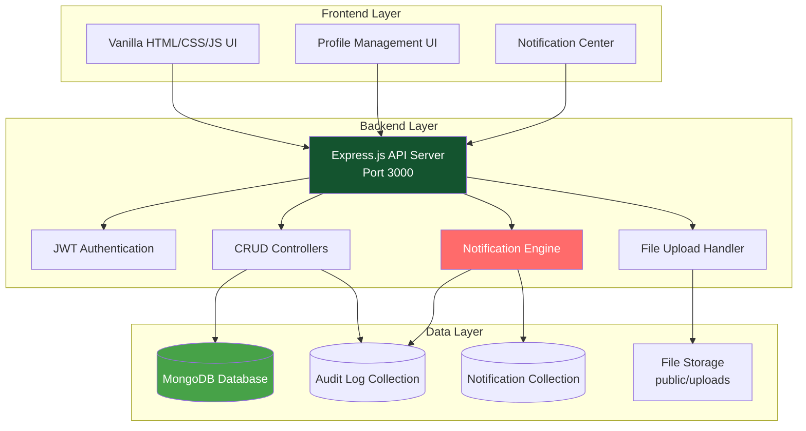
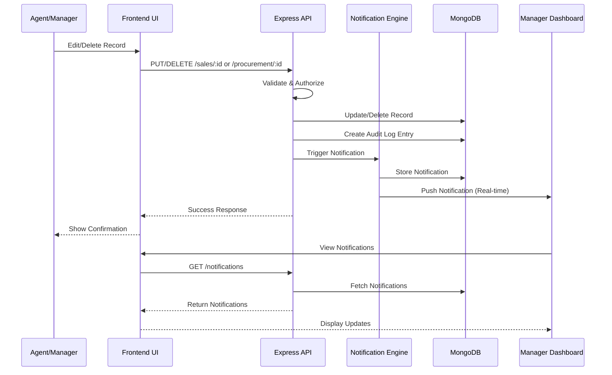

# Design Document: CRUD Operations, Profile Management & Notifications System

## Overview

This design document outlines comprehensive system improvements to the KGL Groceries management system, adding five major feature sets: (1) CRUD operations for sales and procurement records, (2) full profile management with photo uploads, (3) real-time updates and notifications system, (4) reset/undo functionality, and (5) user distinction and filtering system. The design ensures seamless integration with the existing Express.js/MongoDB backend and vanilla JavaScript frontend while maintaining all current functionality, authentication, and the system's port 3000 configuration.

## Architecture

The system follows a three-tier architecture with enhanced real-time capabilities:



## Main Workflow Sequence



## Components and Interfaces

### Component 1: CRUD Operations Controller

**Purpose**: Handles edit and delete operations for sales (cash/credit) and procurement records

**Interface**:
```javascript
interface CRUDController {
  updateCashSale(saleId: string, updates: CashSaleUpdate): Promise<Sale>
  deleteCashSale(saleId: string): Promise<void>
  updateCreditSale(saleId: string, updates: CreditSaleUpdate): Promise<CreditSale>
  deleteCreditSale(saleId: string): Promise<void>
  updateProcurement(procId: string, updates: ProcurementUpdate): Promise<Procurement>
  deleteProcurement(procId: string): Promise<void>
  restoreRecord(recordId: string, entityType: string): Promise<any>
}
```

**Responsibilities**:
- Validate update requests against schema constraints
- Perform authorization checks (role-based access)
- Update inventory when sales/procurement records change
- Maintain referential integrity across collections
- Create audit trail for all modifications
- Trigger notifications to managers
- Support soft delete with restoration capability

### Component 2: Profile Management Controller

**Purpose**: Manages user profile updates including personal information and photo uploads

**Interface**:
```javascript
interface ProfileController {
  getProfile(userId: string): Promise<UserProfile>
  updateProfile(userId: string, updates: ProfileUpdate): Promise<UserProfile>
  uploadPhoto(userId: string, file: File): Promise<string>
  deletePhoto(userId: string): Promise<void>
  validateProfileUpdate(updates: ProfileUpdate): ValidationResult
}
```

**Responsibilities**:
- Handle profile field updates (name, contact, email, location, branch)
- Process photo uploads with validation (file type, size limits)
- Store photos in public/uploads/profiles directory
- Update user records in MongoDB
- Enforce self-update permissions (users can edit own profiles)
- Allow managers to edit any user profile
- Create audit logs for profile changes

### Component 3: Notification Engine

**Purpose**: Manages real-time notifications for record updates and user management actions

**Interface**:
```javascript
interface NotificationEngine {
  createNotification(notification: NotificationData): Promise<Notification>
  getNotifications(userId: string, filters: NotificationFilters): Promise<Notification[]>
  markAsRead(notificationId: string): Promise<void>
  markAllAsRead(userId: string): Promise<void>
  deleteNotification(notificationId: string): Promise<void>
  getUnreadCount(userId: string): Promise<number>
}
```

**Responsibilities**:
- Generate notifications when records are created/updated/deleted
- Include actor information (who made the change)
- Store notifications in MongoDB
- Provide filtering by branch, type, date range
- Support read/unread status tracking
- Enable notification dismissal
- Deliver notifications to appropriate managers

### Component 4: File Upload Handler

**Purpose**: Handles secure file uploads for profile photos

**Interface**:
```javascript
interface FileUploadHandler {
  uploadFile(file: File, options: UploadOptions): Promise<UploadResult>
  validateFile(file: File): ValidationResult
  deleteFile(filePath: string): Promise<void>
  getFileUrl(filePath: string): string
}
```

**Responsibilities**:
- Validate file types (JPEG, PNG, GIF only)
- Enforce file size limits (max 5MB)
- Generate unique filenames to prevent collisions
- Store files in designated directory
- Provide secure file access URLs
- Clean up old photos when replaced
- Prevent directory traversal attacks

### Component 5: User Distinction & Filtering System

**Purpose**: Provides advanced filtering and organization of users by role, branch, and attributes

**Interface**:
```javascript
interface UserFilterController {
  filterUsers(filters: UserFilters): Promise<User[]>
  getUsersByBranch(branch: string): Promise<User[]>
  getUsersByRole(role: string): Promise<User[]>
  searchUsers(query: string): Promise<User[]>
  getUserStatistics(): Promise<UserStats>
}
```

**Responsibilities**:
- Filter users by role (manager, agent, director)
- Filter users by branch (Maganjo, Matugga)
- Support combined filters (role + branch)
- Provide search functionality (name, username, email)
- Generate user statistics and counts
- Support pagination for large user lists

## Data Models

### Model 1: User (Enhanced)

```javascript
interface User {
  _id: ObjectId
  name: string
  username: string
  email: string
  password: string
  role: "manager" | "agent" | "director"
  branch: "Maganjo" | "Matugga"
  contact: string
  location: string  // NEW FIELD
  photo: string     // NEW FIELD - URL to profile photo
  active: boolean
  resetOtp: string
  resetOtpExpiry: Date
  createdAt: Date
  updatedAt: Date
}
```

**Validation Rules**:
- name: minimum 3 characters, required
- username: minimum 3 characters, unique, lowercase, required
- email: valid email format, optional
- password: minimum 6 characters, hashed with bcrypt
- role: must be one of [manager, agent, director]
- branch: must be one of [Maganjo, Matugga]
- contact: valid phone number format
- location: minimum 2 characters, optional
- photo: valid file path or URL, optional
- active: boolean, defaults to true

### Model 2: Sale (Enhanced)

```javascript
interface Sale {
  _id: ObjectId
  produceName: string
  tonnage: number
  amountPaid: number
  paymentMethod: "cash" | "momo" | "bank"
  buyerName: string
  salesAgent: string
  date: Date
  time: string
  branch: "Maganjo" | "Matugga"
  procurement: ObjectId
  recordedBy: ObjectId
  deleted: boolean           // NEW FIELD - soft delete flag
  deletedAt: Date           // NEW FIELD
  deletedBy: ObjectId       // NEW FIELD
  previousVersion: object   // NEW FIELD - for undo functionality
  createdAt: Date
  updatedAt: Date
}
```

**Validation Rules**:
- produceName: alpha-numeric, required
- tonnage: minimum 0.1, required
- amountPaid: minimum 10000 (5 digits), required
- paymentMethod: one of [cash, momo, bank], defaults to cash
- buyerName: minimum 2 characters, required
- salesAgent: minimum 2 characters, required
- date: valid ISO8601 date, required
- time: HH:MM format, required
- branch: one of [Maganjo, Matugga]
- deleted: boolean, defaults to false

### Model 3: CreditSale (Enhanced)

```javascript
interface CreditSale {
  _id: ObjectId
  buyerName: string
  nin: string
  location: string
  contact: string
  amountDue: number
  salesAgent: string
  dueDate: Date
  produceName: string
  produceType: string
  tonnage: number
  dispatchDate: Date
  branch: "Maganjo" | "Matugga"
  procurement: ObjectId
  paid: boolean
  paidAt: Date
  recordedBy: ObjectId
  deleted: boolean           // NEW FIELD
  deletedAt: Date           // NEW FIELD
  deletedBy: ObjectId       // NEW FIELD
  previousVersion: object   // NEW FIELD
  createdAt: Date
  updatedAt: Date
}
```

**Validation Rules**:
- buyerName: minimum 2 characters, required
- nin: minimum 14 characters, required
- location: minimum 2 characters, required
- contact: valid phone number, required
- amountDue: minimum 10000, required
- salesAgent: minimum 2 characters, required
- dueDate: valid date, required
- produceName: alpha-numeric, required
- produceType: alphabetic, minimum 2 characters, required
- tonnage: minimum 0.1, required
- dispatchDate: valid date, required
- deleted: boolean, defaults to false

### Model 4: Procurement (Enhanced)

```javascript
interface Procurement {
  _id: ObjectId
  produceName: string
  produceType: string
  date: Date
  time: string
  tonnage: number
  cost: number
  dealerName: string
  branch: "Maganjo" | "Matugga"
  contact: string
  sellingPrice: number
  recordedBy: ObjectId
  deleted: boolean           // NEW FIELD
  deletedAt: Date           // NEW FIELD
  deletedBy: ObjectId       // NEW FIELD
  previousVersion: object   // NEW FIELD
  createdAt: Date
  updatedAt: Date
}
```

**Validation Rules**:
- produceName: alpha-numeric, minimum 2 characters, required
- produceType: alphabetic, minimum 2 characters, required
- date: valid ISO8601 date, required
- time: HH:MM format, required
- tonnage: minimum 100 (3 digits), required
- cost: minimum 10000 (5 digits), required
- dealerName: alpha-numeric, minimum 2 characters, required
- branch: one of [Maganjo, Matugga], required
- contact: valid phone number, required
- sellingPrice: minimum 0, required
- deleted: boolean, defaults to false

### Model 5: Notification (NEW)

```javascript
interface Notification {
  _id: ObjectId
  recipient: ObjectId        // User who receives notification
  actor: ObjectId           // User who performed the action
  type: NotificationType
  entity: string            // "Sale", "CreditSale", "Procurement", "User"
  entityId: ObjectId
  action: string            // "CREATED", "UPDATED", "DELETED", "RESTORED"
  message: string
  metadata: object          // Additional context data
  read: boolean
  readAt: Date
  branch: "Maganjo" | "Matugga"
  createdAt: Date
}
```

**NotificationType Enum**:
```javascript
enum NotificationType {
  RECORD_CREATED = "RECORD_CREATED",
  RECORD_UPDATED = "RECORD_UPDATED",
  RECORD_DELETED = "RECORD_DELETED",
  RECORD_RESTORED = "RECORD_RESTORED",
  USER_CREATED = "USER_CREATED",
  USER_UPDATED = "USER_UPDATED",
  PROFILE_UPDATED = "PROFILE_UPDATED"
}
```

**Validation Rules**:
- recipient: valid ObjectId, required
- actor: valid ObjectId, required
- type: one of NotificationType enum values, required
- entity: non-empty string, required
- action: non-empty string, required
- message: non-empty string, required
- read: boolean, defaults to false
- branch: one of [Maganjo, Matugga], optional

### Model 6: AuditLog (Enhanced)

```javascript
interface AuditLog {
  user: ObjectId
  action: string
  entity: string
  entityId: ObjectId
  details: object
  previousState: object     // NEW FIELD - for undo functionality
  newState: object         // NEW FIELD
  ip: string
  createdAt: Date
}
```

**New Action Types**:
- UPDATE_CASH_SALE
- DELETE_CASH_SALE
- RESTORE_CASH_SALE
- UPDATE_CREDIT_SALE
- DELETE_CREDIT_SALE
- RESTORE_CREDIT_SALE
- UPDATE_PROCUREMENT
- DELETE_PROCUREMENT
- RESTORE_PROCUREMENT
- UPDATE_PROFILE
- UPLOAD_PHOTO
- DELETE_PHOTO

## Error Handling

### Error Scenario 1: Unauthorized Record Modification

**Condition**: User attempts to edit/delete a record without proper permissions
**Response**: Return 403 Forbidden with error message "You do not have permission to modify this record"
**Recovery**: Log the attempt in audit log, display error message to user, redirect to appropriate page

### Error Scenario 2: Invalid File Upload

**Condition**: User uploads file with invalid type or exceeds size limit
**Response**: Return 400 Bad Request with specific error message (e.g., "File type not allowed. Only JPEG, PNG, and GIF are supported" or "File size exceeds 5MB limit")
**Recovery**: Display error message to user, allow retry with valid file

### Error Scenario 3: Record Not Found

**Condition**: User attempts to update/delete a record that doesn't exist or has been deleted
**Response**: Return 404 Not Found with message "Record not found or has been deleted"
**Recovery**: Refresh the list view, remove stale record from UI cache

### Error Scenario 4: Inventory Inconsistency

**Condition**: Deleting or modifying a sale/procurement causes inventory to become negative or inconsistent
**Response**: Return 400 Bad Request with message "Cannot modify record: would cause inventory inconsistency"
**Recovery**: Rollback transaction, display error with explanation, suggest corrective action

### Error Scenario 5: Concurrent Modification

**Condition**: Two users attempt to modify the same record simultaneously
**Response**: Return 409 Conflict with message "Record has been modified by another user. Please refresh and try again"
**Recovery**: Reload record with latest data, prompt user to review changes and resubmit

### Error Scenario 6: File Storage Failure

**Condition**: Server cannot write uploaded file to disk (permissions, disk full, etc.)
**Response**: Return 500 Internal Server Error with message "Failed to save uploaded file. Please try again"
**Recovery**: Log error details, clean up partial uploads, notify administrators if persistent

### Error Scenario 7: Notification Delivery Failure

**Condition**: Notification cannot be created or delivered to manager
**Response**: Log error but allow primary operation to succeed (notification is non-critical)
**Recovery**: Retry notification creation in background, alert system administrators if failures persist

## Testing Strategy

### Unit Testing Approach

**Test Coverage Goals**: Minimum 80% code coverage for all new components

**Key Test Cases**:

1. **CRUD Operations**:
   - Test successful update of cash sale with valid data
   - Test successful update of credit sale with valid data
   - Test successful update of procurement with valid data
   - Test deletion of records with proper authorization
   - Test soft delete flag is set correctly
   - Test inventory adjustment on sale modification
   - Test inventory adjustment on sale deletion
   - Test validation errors for invalid updates
   - Test authorization failures for unauthorized users
   - Test audit log creation for all operations

2. **Profile Management**:
   - Test profile update with valid data
   - Test profile update with invalid email format
   - Test profile update with invalid phone number
   - Test photo upload with valid image file
   - Test photo upload with invalid file type
   - Test photo upload exceeding size limit
   - Test photo deletion and cleanup
   - Test self-update permissions
   - Test manager update permissions for other users
   - Test audit log creation for profile changes

3. **Notification Engine**:
   - Test notification creation on record update
   - Test notification creation on record deletion
   - Test notification creation on user creation
   - Test notification filtering by branch
   - Test notification filtering by type
   - Test mark as read functionality
   - Test mark all as read functionality
   - Test unread count calculation
   - Test notification deletion

4. **File Upload Handler**:
   - Test file validation for allowed types
   - Test file validation for size limits
   - Test unique filename generation
   - Test file storage in correct directory
   - Test file URL generation
   - Test old file cleanup on replacement
   - Test directory traversal prevention

5. **User Filtering**:
   - Test filter by role
   - Test filter by branch
   - Test combined filters (role + branch)
   - Test search by name
   - Test search by username
   - Test search by email
   - Test pagination
   - Test user statistics generation

### Property-Based Testing Approach

**Property Test Library**: fast-check (JavaScript/Node.js)

**Properties to Test**:

1. **Idempotency Property**: Updating a record multiple times with the same data should produce the same result
   ```javascript
   property("Multiple identical updates produce same result", 
     fc.record({...}), 
     (updateData) => {
       const result1 = updateRecord(id, updateData)
       const result2 = updateRecord(id, updateData)
       return deepEqual(result1, result2)
     }
   )
   ```

2. **Inventory Conservation Property**: Total inventory across all operations should remain consistent
   ```javascript
   property("Inventory quantity is conserved across operations",
     fc.array(fc.oneof(saleGen, procurementGen)),
     (operations) => {
       const initialInventory = getInventory()
       applyOperations(operations)
       const finalInventory = getInventory()
       return inventoryBalanced(initialInventory, finalInventory, operations)
     }
   )
   ```

3. **Audit Trail Completeness Property**: Every modification should have a corresponding audit log entry
   ```javascript
   property("All modifications create audit logs",
     fc.oneof(updateGen, deleteGen),
     (operation) => {
       const beforeCount = countAuditLogs()
       performOperation(operation)
       const afterCount = countAuditLogs()
       return afterCount === beforeCount + 1
     }
   )
   ```

4. **Notification Delivery Property**: Every record modification should trigger appropriate notifications
   ```javascript
   property("Record modifications trigger notifications",
     fc.record({...}),
     (modification) => {
       const beforeCount = countNotifications(managerId)
       performModification(modification)
       const afterCount = countNotifications(managerId)
       return afterCount > beforeCount
     }
   )
   ```

5. **Soft Delete Reversibility Property**: Deleted records can be restored to their previous state
   ```javascript
   property("Soft deleted records are restorable",
     fc.record({...}),
     (record) => {
       const original = createRecord(record)
       deleteRecord(original.id)
       const restored = restoreRecord(original.id)
       return deepEqual(original, restored)
     }
   )
   ```

### Integration Testing Approach

**Test Scenarios**:

1. **End-to-End CRUD Flow**:
   - Create a sale record
   - Update the sale record
   - Verify inventory adjustment
   - Verify audit log creation
   - Verify notification delivery
   - Delete the sale record
   - Verify soft delete flag
   - Restore the sale record
   - Verify restoration

2. **Profile Management Flow**:
   - User logs in
   - User updates profile information
   - User uploads profile photo
   - Verify photo is accessible
   - Manager views user profile
   - Manager updates user information
   - Verify audit logs for both updates

3. **Notification Flow**:
   - Agent creates a sale
   - Manager receives notification
   - Manager marks notification as read
   - Agent updates the sale
   - Manager receives update notification
   - Manager filters notifications by branch
   - Manager deletes old notifications

4. **User Filtering Flow**:
   - Manager accesses user management
   - Manager filters users by branch
   - Manager filters users by role
   - Manager searches for specific user
   - Manager views user statistics
   - Manager creates new user
   - Verify new user appears in filtered lists

## Performance Considerations

**Database Indexing**:
- Add index on Sale.deleted for efficient filtering of active records
- Add index on CreditSale.deleted for efficient filtering
- Add index on Procurement.deleted for efficient filtering
- Add index on Notification.recipient and Notification.read for fast notification queries
- Add compound index on Notification (recipient, createdAt) for sorted queries
- Add index on User.location for location-based filtering
- Add index on User.photo for photo management queries

**Query Optimization**:
- Use projection to limit fields returned in list views
- Implement pagination for all list endpoints (default 20 items per page)
- Use lean() queries when full Mongoose documents not needed
- Implement caching for frequently accessed data (user profiles, inventory levels)
- Use aggregation pipelines for complex filtering and statistics

**File Upload Optimization**:
- Implement file size validation before upload starts
- Use streaming for large file uploads
- Compress images on upload (resize to max 800x800px)
- Serve static files through nginx in production
- Implement CDN for profile photos in future scaling

**Notification Performance**:
- Batch notification creation for bulk operations
- Implement notification cleanup job (delete read notifications older than 30 days)
- Use database triggers or change streams for real-time notifications (future enhancement)
- Limit notification queries to last 90 days by default

**Concurrency Handling**:
- Use MongoDB transactions for operations affecting multiple collections
- Implement optimistic locking with version fields for concurrent updates
- Use atomic operations ($inc, $set) where possible
- Implement retry logic for transient failures

## Security Considerations

**Authentication & Authorization**:
- Maintain existing JWT-based authentication
- Verify user identity for all profile updates
- Enforce role-based access control (RBAC) for CRUD operations
- Managers can edit/delete any record in their branch
- Agents can only edit/delete their own records
- Directors have read-only access to all records
- Users can only update their own profiles (except managers can update any profile)

**File Upload Security**:
- Validate file types using MIME type checking (not just extension)
- Enforce strict file size limits (5MB maximum)
- Generate random filenames to prevent enumeration
- Store files outside web root or with proper access controls
- Scan uploaded files for malware (future enhancement)
- Prevent directory traversal attacks in file paths
- Implement rate limiting on upload endpoints

**Data Validation**:
- Sanitize all user inputs to prevent XSS attacks
- Validate all data against schema before database operations
- Use parameterized queries to prevent NoSQL injection
- Implement CSRF protection for state-changing operations
- Validate ObjectId formats before database queries

**Audit & Compliance**:
- Log all CRUD operations with user identity and timestamp
- Store previous state for all modifications (undo capability)
- Implement soft delete to maintain data history
- Ensure audit logs are immutable (append-only)
- Include IP address in audit logs for security tracking

**Privacy & Data Protection**:
- Hash passwords with bcrypt (existing implementation)
- Never expose password fields in API responses
- Implement proper session management
- Allow users to delete their own profile photos
- Ensure deleted records are not exposed in API responses

## Dependencies

**Existing Dependencies** (maintained):
- express: ^4.18.0 - Web framework
- mongoose: ^7.0.0 - MongoDB ODM
- jsonwebtoken: ^9.0.0 - JWT authentication
- bcryptjs: ^2.4.3 - Password hashing
- express-validator: ^7.0.0 - Request validation
- helmet: ^7.0.0 - Security headers
- cors: ^2.8.5 - CORS handling
- morgan: ^1.10.0 - HTTP logging
- dotenv: ^16.0.0 - Environment variables

**New Dependencies** (to be added):
- multer: ^1.4.5 - File upload handling
- sharp: ^0.32.0 - Image processing and compression
- mime-types: ^2.1.35 - MIME type validation

**Development Dependencies**:
- fast-check: ^3.15.0 - Property-based testing
- supertest: ^6.3.0 - HTTP integration testing
- mongodb-memory-server: ^9.1.0 - In-memory MongoDB for testing

**Infrastructure**:
- MongoDB: ^6.0 - Database (existing)
- Node.js: ^18.0 - Runtime (existing)
- File system: Local storage for profile photos (public/uploads/profiles/)
